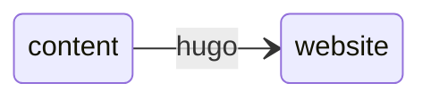
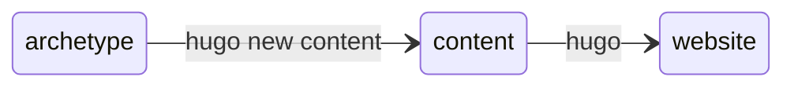
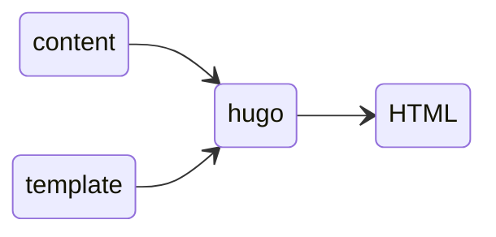
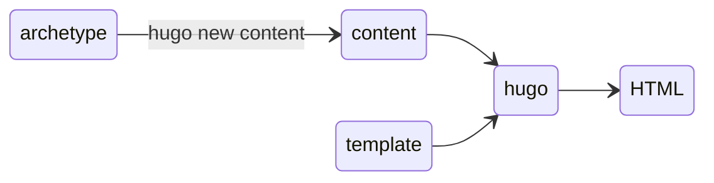
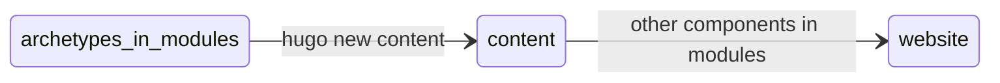
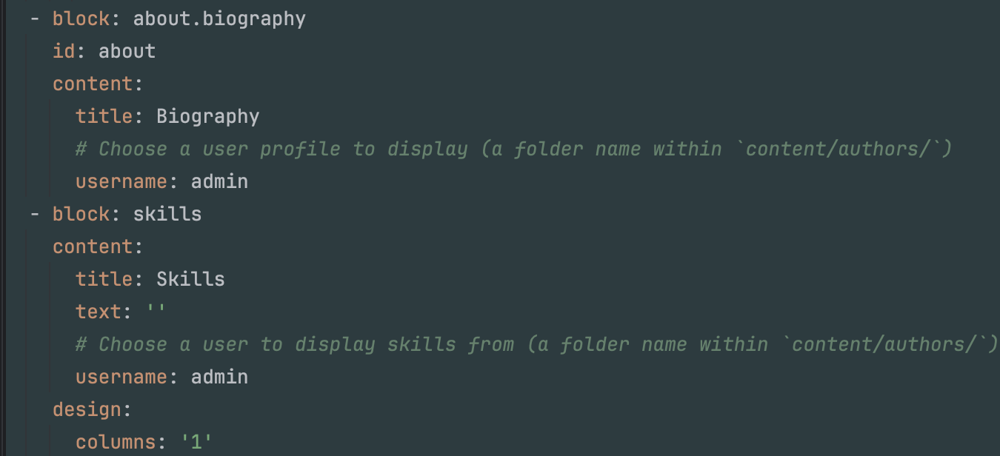
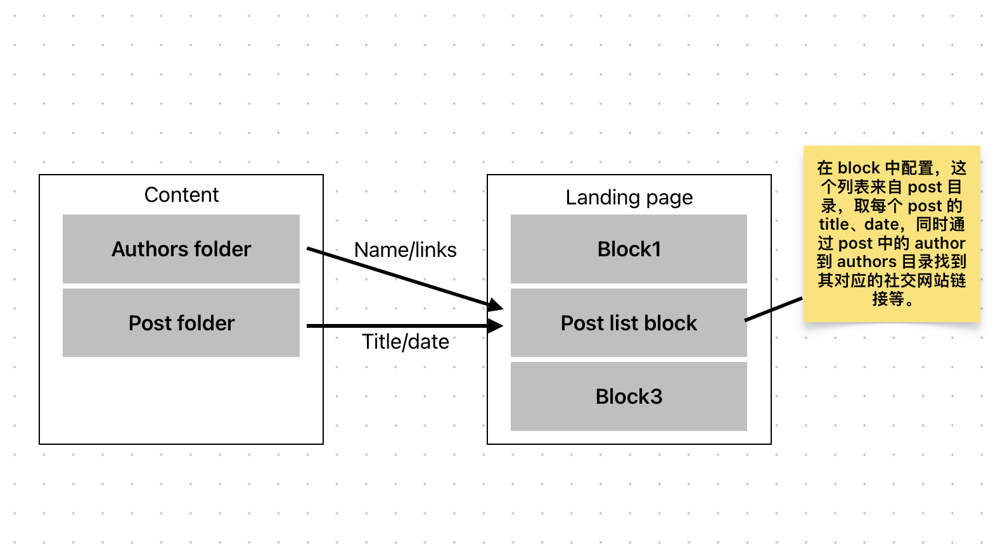

本文会介绍：
+ 静态网站
+ 静态网站生成工具 Hugo/Wowchemy
+ Wowchemy 模版：Research Group 和 Academic

我们首先快速上线一个网站，然后配合网站具体讲解。

## 快速上线个人子站

所谓**个人子站**没有什么严格定义，在我们团队的规划下暂且定义为：团队成员的个人网站，可以通过团队域名的一个子域名访问到。

比如你现在浏览的网站 [pxq.grokcv.ai](https://grokcv.ai) 就是 [grokcv.ai](https://grokcv.ai)[^0] 的个人子站。

在我们团队内想要快速上线这样一个网站，只需要三步：
1. 点击 [魔法链接](https://github.com/new?template_name=theme-academic-cv&template_owner=HugoBlox&owner=grokcv&name=pxq-site&visibility=public)[^1]
2. 修改 repo 名称为 **yourname-site**（比如本站的 repo 名称为 pxq-site）
3. 通知管理员

如果管理员没在忙，大概10分钟后你就能访问自己的个人子站了。

## 静态网站

前面快速上线的这个网站和常见的博客、企业官网、技术文档等等网站中大多数类似，是一个静态网站[^2]。

这类网站之所以选择静态网站技术，核心原因是对更新频率的要求比较低（通常更新周期大于构建发布所需要的时间），所以有内容需要更新时重新构建发布一次就好了。
静态网站技术在满足了低频内容型网站的核心需求的同时，也带来许多额外的好处：
+ 安全性较高
+ 服务器成本更低
+ 支持的部署平台更广泛

所有这些好处都来自于静态特性，即用户访问网站时**服务端不执行代码**。

有人可能会疑惑，这类网站似乎已经是十多年前的内容展示方式了，目前大家基本都在微信公众号和抖音、B站等音视频平台上消费内容，**为什么还需要静态网站？**

### 1、平台存在较强的地域性
希望我们的内容更容易在世界范围内被更多人看到。

国内百度已经几乎没法用了，搜索入口实际已经转移到了小红书、B站、美团等等。
其中大部分平台都在做去互联网化，原来的各种开放标准因为效率上的劣势和细分需求匹配度低的原因正在逐渐沦为濒危标准。
由于中国互联网发展较晚，这一情况尤为明显，正如移动支付让我们一举跳过信用卡体系，我们的一些公共组织也正在跳过网站的建设，用微信公众号、本地生活类平台做自我介绍和门票售卖等。

前段时间刚去了日本关西游玩，出行前做攻略时几乎都是直接在小红书、B站上搜索，不过有些意外的发现京都几乎每个寺庙都有自己良好设计的官方网站，比如 [清水寺](https://www.kiyomizudera.or.jp/)、[琉璃光院](https://rurikoin.komyoji.com/) 等。
而杭州西湖这般著名的景区，目前只找到管委会的网站上有一段文字介绍 [西湖风景名胜区概况](https://westlake.hangzhou.gov.cn/col/col1598539/index.html)，但是你能在微信中找到西湖的视频号、公众号，里面都有很优秀的图文音视频内容来展示这个景区。

想象一下如果京都这些寺庙的介绍是在“日本微信”的公众号里，那我大概率不会看到了。
当然这些内容是否有独立网站来展示并没有什么大问题，甚至对于国内游客来说，在微信平台中展示比网站是更有效的。

我们科研活动产出的内容适合用被更广泛支持的标准去呈现，让世界各地的读者都能轻松访问。

### 2、平台的生命周期和数据安全性

经历各种大平台的起起伏伏后，会发现这些大平台的生命周期或许不如我们的内容，至少我们的愿景是希望我们内容的生命比平台更长久。

同时大平台的数据安全性也不见得更高，最近几个月大家也都有所耳闻，语雀、阿里云等平台接连故障，虽然没有造成严重的数据丢失问题，但是对于重要内容的保存我想应该有些更长远的规划。

我们目前使用静态网站的方式天然具备了多种形式的备份：
+ 本地 git 仓库
+ 远端 git 仓库
+ 线上网站

本地 git 仓库的存在避免远端 git 仓库服务商（github 等）故障导致数据丢失。

远端 git 仓库存在避免个人发生意外社区可以继续维护这份内容，也可以轻易部署到新的服务器上。
会想到个人意外源于 2023 年陈皓（左耳朵耗子）突然去世，他的个人站点 [coolshell.cn](https://coolshell.cn/) 我从大学时期就一直在看，他去世后可能某一天突然就不能访问了。

### 3、更灵活的表现形式

平台能提供的内容表现形式和自建网站相比相对有限，而且目前大多数平台都是移动端优先，而我们产生的内容在PC这类工作设备上的展现占比可能更大。

我们团队选择了在学术界广泛使用的 Hugo/Wowchemy 这套静态网站工具来构建部署我们的网站。
接下去会介绍这套工具整体的结构思路、关键概念的设计理由，同时为了便于理解，某些部分不会特别严谨。
详细完整的说明可以直接访问它们的官方文档：[Hugo 文档](https://gohugo.io/documentation/)、 [Wowchemy 文档](https://docs.hugoblox.com/) 。

## Hugo

作为一个静态网站生成器，其核心功能就是：

我们专注内容生产，其他问题都由 **Hugo** 来处理。

### content

内容是什么？内容可以是你的简历介绍，可以是一篇文章等等。
从编程的概念来理解的话，它们共同的本质是一个**对象**（字典），不同类型的内容有一些不同的字段，比如一篇 post 有三个字段：
```python
post = {
  date: '2023-12-27',   # 发布日期
  title: '文章标题',     # 文章标题
  content: '文章正文\n第二行内容'    # 正文内容
}
```
但是使用编程语言中的对象语法来编写内容不是一个明智的选择，就像许多配置文件会使用 `yaml` 和 `toml` 之类的格式，
markdown 文件中通过 **front matter** 支持除了正文之外的字段输入，而 **front matter** 的格式同样支持 `yaml`、`toml`等。
这样一篇 post 就可以使用 markdown 来编写:
```md
# content/post/demo.md
---
date: 2023-12-27
title: "文章标题"
---

文章正文
第二行内容
```

目前为止编写一篇 post 的方式已经相当简单明了，但是大多数时候一种内容的字段可能不止这样3个，包括 post 这类内容也可以有 tags、category 等更多字段:

```md
# content/post/demo.md
---
date: 2023-12-27
title: "文章标题"
tags: ["Hugo", "Wowchemy"]
category: "demo"
---

文章正文
第二行内容
```

这里有个问题，如果内容字段很多，当我们要新增一篇 post 时都要重复编写 date/title/tags/category 等这些字段，这样的重复行为会让人厌烦，我的第一反应是复制已有的一个文件，然后修改字段内容。
接着又发现 date 这个字段就是新建 post 的时候的日期，那自动生成就好了，不如写个 python 脚本来完成内容模版的生成：
```python
# gen_post.py
import datetime

def print_post_md(title):
    print(f'''
---
title: {title}
date: {datetime.date.today()}
tags: []
category: 
---

''')

if __name__ == '__main__':
    print_post_md('文章标题')
```

然后在项目根目录执行 `python gen_post.py > content/post/demo.md` 即可，当我们需要新增其他内容比如简历时可以再写一个脚本比如 `gen_resume.py`。

其实 Hugo 已经考虑到了这个需求，引入了相关概念称为 **Archetype**。

### Archetype

Archetype 表示一种内容的模版，比如 post 的 archetype 可以是这样：
```md
# archetypes/post.md
---
title: '{{ replace .File.ContentBaseName "-" " " | title }}'
date: '{{ .Date }}'
tags: []
category: 
---
```

Hugo 在创建内容文件时会通过某些规则[^3]找到对应的 archetype，并且将 `{{ .Date }}` 这类占位替换为计算后的值。
常用的 archetype 查找规则[^3]是通过**内容目录**自动查找，
比如执行命令：`hugo new content post/demo.md` 表示要创建一个内容文件 `demo.md`，它的的路径是 `content/post/demo.md`，那么它的目录就是 `post`，Hugo 就会自动查找到 `archetypes/post.md` 文件作为 archetype 来生成 `post/demo.md` 文件。
所以现在 Hugo 的功能结构可以理解为：


现在有了辅助我们生成内容的工具 archetype，再来看下从内容到网站：

这一步是怎么做的。

在此之前我们知道网站有一系列网页构成，网页最基础的格式是 HTML，所以问题就简化成 Hugo 如何生成 HTML，为此 Hugo 引入的相关概念是 **Template**。

### Template

template 是一些使用 Go 语言模版[^4]语法编写的 `.html` 文件，存放在 `layouts` 目录下。
Hugo 在生成网页时会把 content 中的字段插入到 template 对应的位置，所以生成网页的过程可以理解为 content + template => HTML：


比如单个 post 页面的 template 可以是这样：
```html
<!- layouts/post.html ->
<html>
    <head>
      <title>{{ .Title }}</title>  <!- .Title 对应 front matter 中的 title 字段 ->
    </head>
    <body>
        <header>
          <div>{{ .Date }}</div>
        </header>
        <main>{{ .Content }}</main> <!- .Content 对应 .md 文件中的正文 ->
    </body>
</html>
```

结合 `post/demo.md` 中的字段，会生成类似如下 HTML:
```html
<html>
    <head>
      <title>demo</title>
    </head>
    <body>
        <header>
          <div>2024-01-01</div>
        </header>
        <main>文章正文</main>
    </body>
</html>
```

到此 Hugo 的功能结构大致可以理解成:


+ 编写 archetype 文件
+ 使用 `hugo new content archetype/file.md` 生成内容文件
+ 编写 template
+ 生成网页

接着我们会发现，我们要编写的内容类型是不是和别人的都差不多，比如 post、resume 等，
我们要展示的网站样子是不是也和别人差不多，或者我就想直接借用其他一个网站的样子。

因为我们真正关注的是内容本身，所以 Hugo 引入了 **Theme** 来提供除了内容本身之外其他功能的分享复用机制。

### Theme

在说明 theme 之前，先来了解一下 Hugo 的 **7 大组件（目录）**：
+ *archetypes*
+ *content*
+ *layouts*
+ assets
+ data
+ i18n
+ static

其中 archetypes/content/layouts 前面已经讲到过，剩下几个分别用作：
+ assets: 样式等资源文件
+ data: 大型结构化数据（不适合放在 front matter 中）
+ i18n: 国际化多语言相关
+ static: 全局静态资源等

前面有意避开了这 4 个目录，本文后续也不做过多说明，因为不影响对整体结构的理解。
这 7 大组件共同作为源文件，被 Hugo 处理后生成最终的网站。

那么 theme 是什么，theme 是一个子目录，内部同样是这 7 大组件:
<video src="./theme-dir.av1.mp4" controls></video>
Hugo 在生成网站时通过某种优先级规则**合并**了主目录和 theme 目录下 7 大组件的文件。

所以当我们看到某个网站的 theme 正是我们想要的，就可以直接复制到我们自己网站的 themes 目录下。

接着当这个 theme 无法满足我们的需求时，比如原来的 theme 只实现了 post，你想增加 resume，可以在主目录的 7 大组件下直接新增对应的文件来实现，因为合并规则的优先级是 主目录 > theme。

这时候又出现了一个问题，你的需求大概率也不是一个特殊的需求，所以你的实现可以分享给别人，也可以找到已有的实现。

关于分享和复用，有几种方式：
1. 直接在 theme 目录中修改，他人复用时直接复制粘贴
2. 将 theme 独立出去使用 git submodule 引入

第一种方式很原始，他人也很难及时了解 theme 的更新。
第二种方式解决了 theme 的独立管理，快速跟进更新，但是 git submodule 本身设计存在缺陷[^5]，也不是一个良好的实践。

关于使用已有的实现，Hugo 其实还有更多考虑：支持**多 theme 合并**，可以指定多个 theme 的优先级关系，比如 主目录 > theme1 > theme2。
但是这样的多 theme 还是存在一些问题，比如两个 theme 都实现了 A、B 两个功能，我想使用 theme1 的 A 和 theme2 的 B 就没法实现，而每个 theme 如果只实现一个功能那也不符合 theme 这个概念的含义。
从上面可以看出，在当前 theme 这个概念下继续支持更灵活配置，会让其过于复杂。

theme 最初的设计是简洁清晰的，但是在当下技术体系（使用 git 之类的进行版本管理等）和更灵活的使用需求（将多个theme上的功能结合起来使用等）上有点力不从心。
因此 Hugo 后续推出了 **modules** 概念。

### Modules

module 的组成同样是 7 大组件，和 theme 的区别是：
+ 从概念上来说，一个 module 可以表达从一个功能到一个 theme 的任意范围，甚至可以不是完整的功能（只作为其他 module 的依赖项）
+ 正如 Hugo 使用 Go 语言模版语法一样，Hugo modules 直接使用 Go 语言的模块机制来分发和使用，就像在 Python 中使用 pip。

至此我们使用 Hugo 整体结构可以理解为：


既然 Hugo 提供了模块机制，不难想象已经有团队推出基于 Hugo modules 的主题模版，没错就是 **Wowchemy**。

## Wowchemy

Wowchemy 最初的命名可能来自 Wow + alchemy => Wowchemy，表示扔进去一堆 `.md` 文件，输出一个漂亮的网站，这一**神奇**的转化过程。

Wowchemy 组织下有许多项目，主要可以分为两类：
1. 几个相互配合的 **Hugo modules**
2. 使用这些 Hugo modules 配置好的几个 **repo template**

### Hugo modules

Wowchemy 提供的 Hugo modules 包括：
+ core：其他 module 的公共部分
+ seo：搜索引擎优化
+ bootstrap：使用 bootstrap 作为样式库的一个通用 theme module，后面会详细说明
+ tailwind：和 bootstrap 类似，tailwind 是最近几年 Web 前端比较流行的样式库
+ decap-cms：使用 git api 作为后端的内容管理
+ netlify：在 netlify 上部署相关的 module
+ reveal：在线 Slides

### Repo template

Github 这类服务商提供了 repo template 的功能，用来快速创建同一类型的 repo，[快速上线个人子站](#快速上线个人子站) 正是使用了 Wowchemy 提供的 repo template **Academic** 来帮助我们快速创建自己的 Academic 网站源码 repo。
Wowchemy 提供的所有 templates 可以查看 [Wowchemy templates](https://hugoblox.com/templates/)。

那么 Wowchemy 何以做到在其提供的有限几个 [Hugo modules](#hugo-modules) 的基础上不编写额外代码就可以产出这么多 templates？
内容网站还有一个十分常见的需求前面没有讲到，目录、摘要等等页面和完整具体的内容页面是有一些内容需要共享的，比如文章列表中也要展示：文章标题、发布时间等等，如何设计一种机制满足这类需求？

Wowchemy 对于这些问题的答案就是 **blocks**，这也是其在 Hugo 基础上提供的核心价值，所以 Wowchemy 现在也已经改名为 **Hugo blox**。

**blocks** 是什么？

在用户角度看，一个 block 就是 front matter 中某个列表的一员，内部包含一些字段，比如  这里有两个 block，它们的类型分别是 `about.biography` 和 `skills`。
我们只要按这个样子填写内容，最终生成的网页中，多个 block 会从上向下排列，[本网站首页](/) 正是使用了这些 block。

从功能设计来看，block 分为几个部分：
+ 配置：在 landing page 的 front matter 中配置 block
+ 内容：Hugo 根据上面的配置从其他内容文件中找到相关内容，比如 `about.biography` 中的 username，Hugo 会用这个字段去 `content/authors` 下查找对应的内容。
+ 展示：Hugo 根据上面的配置和找到的内容，按照 block 类型对应的 template 生成页面中这一块内容


这是一个不严谨的举例，只是说明 block 的设计思路。

因为我们团队所使用的两个 template: [Research Group & Academic](#research-group--academic) 都是基于 bootstrap 这个 Hugo module 来实现的。

### bootstrap module

正如前面讲到，bootstrap 作为一个 Hugo module 是由 7 大组件构成。

它实现的 archetype 包括 authors、post、event、publication 等等，后面讲模版 [Research Group](#research-group) 时会对这几种 archetype 作更多说明。

它实现了一些常规 page template 之外，还有一个称为 **landing** 的 template，这个 landing 就是由上面提到的 **blocks** 组成。


#### Blocks in bootstrap module
这里介绍 bootstrap 中具有代表性的几个 block:
+ markdown：完全自由的 markdown 语法
+ skills：会从 `content/authors` 中找到对应的 skills 字段进行展示
+ collection：相对通用的 block，可以用来展示一些列表，比如文章列表等

关于这些 block 的详细使用方式可以参考个人子站源文件中的 `content/_index.md`

## Research Group & Academic

前面讲了 Hugo 和 Wowchemy 的整体结构和一些概念的设计理由，到这里我们落地于具体的项目模板 [Research Group]() 和 [Academic]()，看看如何进行网站内容日常编辑。
这两个都是 Wowchemy 官方基于其几个常用 modules 提供的项目模版，也是在学术界比较常用的团队和个人模版，可以像 [快速上线个人子站]() 中提到的那样直接使用。

### Research Group

我们团队网站 [grokcv.ai](https://grokcv.ai) 正是使用了该模版。
关于这个模版，我们平时需要编辑的不多，只需要关注以下几项：
+ 添加你的信息
+ 新增 post
+ 新增 publication
+ 新增 event

#### 你的信息

在该模版概念中，你是作为团队 authors 中的一员，所以你的个人信息这种内容的 archetype 是 `authors`，生成对应的内容通过前面提到过的命令：
```bash
hugo new content authors/yourname
```
会生成 `content/authors/yourname` 目录作为你个人信息内容存放的目录，包含初始化的内容文件 `_index.md`，接着修改该文件的 front matter 即可。

#### post

如果你有新的文章需要添加到团队网站，执行命令 `hugo new content post/post-name` 即可。

#### publication

和 post 类似：`hugo new content publication/name`，增加了许多专业特性：PDF、Code、Dataset 等等。

#### event

新增命令 `hugo new content event/name`，可将线上线下的一些活动日程公布在这里，也可以将活动演讲相关文件添加到此处。

### Academic

这个是你的个人子站使用的模版。


[^0]: 我们团队的网站
[^1]: [关于魔法链接](https://docs.github.com/en/repositories/creating-and-managing-repositories/creating-a-new-repository#creating-a-new-repository-from-a-url-query)
[^2]: HTML、Javascript、CSS等文件是不变的，Web服务器只负责将这些文件返回给浏览器，服务端基本不执行代码来获取内容
[^3]: 关于查找规则完整的说明可以查看[官方文档](https://gohugo.io/content-management/archetypes/#lookup-order)
[^4]: Hugo 是用 Go 语言实现的，所以直接使用 Go 语言的模版语法，具体[参考](https://gohugo.io/templates/introduction/)
[^5]: 可以参考 [为什么我不推荐你使用 git submodule](https://linuxstory.org/why-never-use-git-submodule/)

